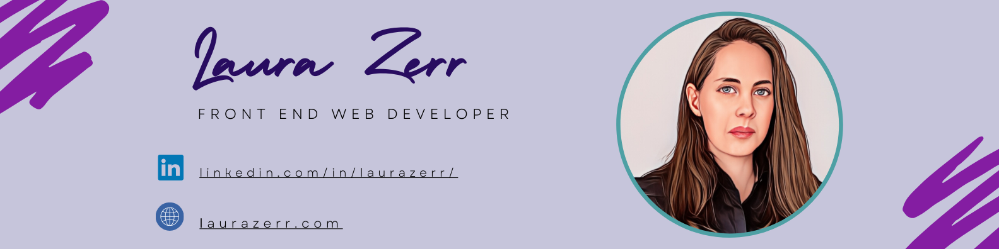

<!-- Hi there! Welcome to my page!-->
</img>

<h1 align="left"> I'm Laura Zerr! 👋🏻</h1>

A Front End Web Developer with a strong background in Psychology, dedicated to creating dynamic web applications. I love using my scientific skills and creativity when transforming ideas into functionally beautiful products. I am constantly seeking opportunities to expand my knowledge and embrace new challenges along the way.

- 🔭 I’m working on strengthing my **JavaScript** and **React** skills.
  
- 🌱 I’m learning how to build **AI Apps with ChatGPT**, **DALL-E**, and **GPT-4**.

- ⚡ Fun fact: I am a **hobbyist photographer**.
  
- 📫 How to reach me: **llzerr76@gmail.com**

---

### 🛠️ Languages and Tools:

  &nbsp;
  &nbsp;
  &nbsp;
  &nbsp;
  &nbsp;
  &nbsp;
  &nbsp;
  &nbsp;
  
  
  
  
  
  
  

---

### 🔥 My Stats:

<!-- 

 --> 

  
  
  

</img>
<!--
**ll-zerr/ll-zerr** is a ✨ _special_ ✨ repository because its `README.md` (this file) appears on your GitHub profile.

Here are some ideas to get you started:
- 👯 I’m looking to collaborate on ...
- 🤔 I’m looking for help with ...
- 💬 Ask me about ...
- 😄 Pronouns: ...

-->
